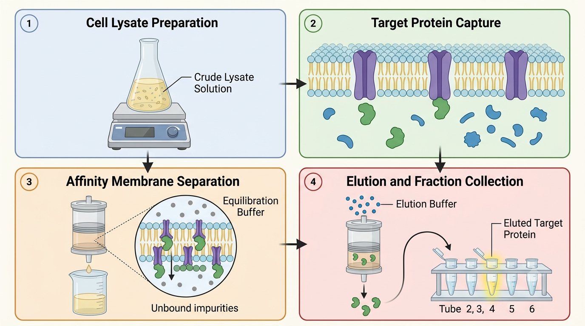

# AI_image_generation

This repository contains sample prompts for generating scientific illustrations. The generated images produced from those prompts are included as well. A sample image generated using one of the prompts is shown below:

## Directory structure

- `anatomy/`
  - Prompts focused on **cell/organ/organelles structures** (what the parts look like).

- `pathways/`
  - Prompts focused on **biological processes in sequence** (signaling, gene regulation, replication, etc.).

- `pathways_additional/`
  - Extra pathway-style prompts that don’t fit neatly into the main `pathways/` subfolders.

- `techniques/`
  - Prompts focused on **methods/technologies** (lab/biotech techniques like genome editing, delivery concepts, etc.).

- `workflows/`
  - Prompts focused on **step-by-step experimental or lab workflows** (what happens in order during an experiment).

- `general_templates/`
  - Reusable diagram/layout templates (e.g., 3-panel templates or sample workflow layouts) that you can adapt for new subjects.

The images corresponding to the prompts are also present in the aforementioned folders:
- anatomical_organ_model_female_silhouette_prompt_image.png
- anatomical_organ_model_male_silhouette_image.png
- apoptosis_pathway_image.png
- cell_signaling_pathway_and_gene_activation_image.png
- intercellular_signalling_cascade_image.png
- gut_brain_axis_crosstalk_image.png
- gene_expression_regulation_image.png
- intestinal_epithelium_diapedesis_image.png
- tumor_microenvironment_diagram_image.png
- centrifugation_and_microscopy_workflow_image.png
- liquid_handling_and_protocol_flow_image.png
- experimental_workflow_diagram_image.png
- three_step_workflow_for_cell_lysis_and_rna_extraction_prompt.png
- four_step_schematic_of_target_protein_capture_and_elution_image.png
- protein_handling_and_downstream_assay_image.png
- crispr_cas9_genome_editing_photo.png
- lipid_nanoparticle_mrna_editing_mechanism_image.png
- liposome_nanoparticle_structure_image.png
- receptor_ligand_binding_image.png
- transmembrane_receptor_activation_image.png
- organelle_structure_mitochondrion_image.png
- protein_folding_and_chaperones_image.png
- sample_scientific_workflow_with_text_at_the_bottom_image.png

## How to use

1. Pick a prompt file from the appropriate category folder.
2. Use that prompt with your image generation model - you can paste the prompts at the following link to generate the images: https://gemini.google.com/app
3. Reference the corresponding example images included in the repo for the expected output style.

## License

CC0-1.0
